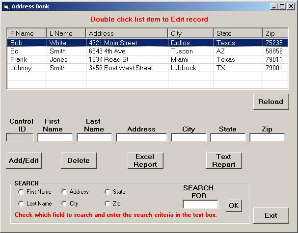



## Address Book

### Description

UPDATED code to show ADO connection to MS Access with SEARCH, ADD, EDIT, DELETE to and from the database. Two type of reports can be created 1. Excel, 2. Text file. This program is meant as a tutorial with maticulous coding comments. PLEASE VOTE
 
### More Info
 

             |
---                |---
**Submitted On**   |2010-11-11 00:28:58
**By**             |[M\.J\. Phelan](https://github.com/Planet-Source-Code/PSCIndex/blob/master/ByAuthor/m-j-phelan.md)
**Level**          |Beginner
**User Rating**    |4.4 (22 globes from 5 users)
**Compatibility**  |VB 6\.0
**Category**       |[Databases/ Data Access/ DAO/ ADO](https://github.com/Planet-Source-Code/PSCIndex/blob/master/ByCategory/databases-data-access-dao-ado__1-6.md)
**World**          |[Visual Basic](https://github.com/Planet-Source-Code/PSCIndex/blob/master/ByWorld/visual-basic.md)
**Archive File**   |[Address\_Bo21925311112010\.zip](https://github.com/Planet-Source-Code/m-j-phelan-address-book__1-73580/archive/master.zip)

